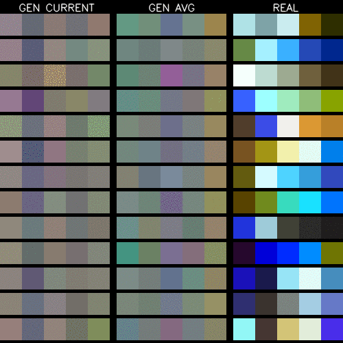

# ColorGAN

DNN generating random color palettes.



## Download dataset

Dataset is fetched by crawling through color.adobe.com. To download the dataset you can run

```
python download.py dataset.json
```

but first you have to have Chrome installed and download Chromedriver from [here](https://chromedriver.storage.googleapis.com/index.html?path=79.0.3945.36/) + in `download.py` you have to change variable `CHROMEDRIVER_BINARY_PATH` on line 10 so it points to downloaded binary.

## Training

To train you can use `train.py` which works even with no arguments, in case you want to go crazy and use other than default, non-optimized parameters, have a look at the arguments. Lines 204-210 of `train.py` should give you a good idea about what's expected to be in YAML specs.

## Generate colors

Once you have trained a model, you can use it to generate colors with `generate.py`. The script will print generated color palettes in hexadecimal format, if you specify `--show_colors` flag, the generated colors will be also shown.

# DNN stuff

- very small, two layer MLP
- vanilla GAN loss
- the saved model is produced by running-averaging weights during the training
- rought measure of GAN quality is Sliced Wasserstein Distance metric, implementation adopted from [Tero Karras](https://github.com/tkarras/progressive_growing_of_gans)